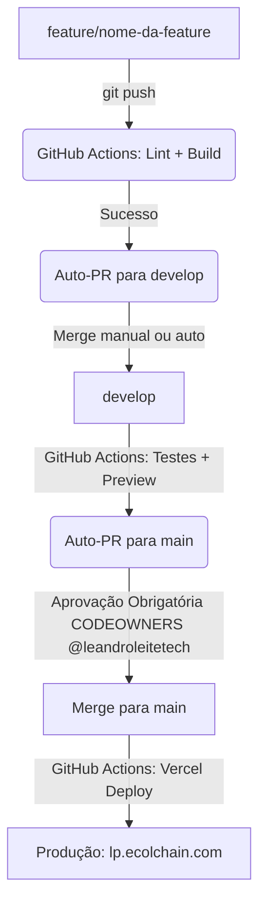

# 🚀 ECOLchain Landing Page - Project Plan & Execution Checklist

Documento de planejamento e acompanhamento do projeto de Landing Page para a **ECOLchain**.

---

## 📌 1. Visão Geral da Arquitetura

- **Frontend:** Next.js 16+ (App Router) + React + TypeScript + Tailwind CSS v4 + Lucide Icons (localizado na pasta `/app`).
- **Hospedagem:** Vercel (Projeto `ecolchain-landing-page-web`).
- **Domínio Oficial:** **`lp.ecolchain.com`**
- **Domínio & DNS:** Cloudflare (Gerenciamento do subdomínio `lp` CNAME para Vercel `cname.vercel-dns.com`).
- **IaC (Infraestrutura como Código):** Terraform (Providers Vercel & Cloudflare em `ecolchain-infra-networks-networks/infra/terraform/landing-page`).
- **CI/CD & Git Flow:** GitHub Actions + `CODEOWNERS` (`@leandroleitetech`).

---

## 🔄 2. Fluxo de Trabalho (Git Flow & PRs Automáticos)

### Regras das Branches:
1. **`feature/*`**: Desenvolvimentos e melhorias de código.
2. **`develop`**: Branch de integração/staging.
3. **`main`**: Branch de produção. Exige revisão e aprovação explícita do `@leandroleitetech` via `CODEOWNERS`.

---

## 📋 3. Checklist de Execução

### **Fase 1: Preparação do Ambiente & Documentação**
- [x] Levantar requisitos e arquitetura (Next.js 16+, Terraform, Vercel, Cloudflare).
- [x] Inspecionar dados e infraestrutura existente no repositório `ecolchain-infra-networks-networks`.
- [x] Criar este documento de acompanhamento (`PROJECT_PLAN.md`) com checklist.

### **Fase 2: Instalação e Inicialização do Projeto Next.js 16+**
- [x] Verificar/instalar Vercel CLI localmente (v60.1.3 instalada).
- [x] Inicializar a estrutura base do Next.js 16+ com TypeScript e Tailwind CSS v4 em `/app`.
- [x] Configurar ESLint, TypeScript e Lucide Icons.
- [x] Criar componentes base de Landing Page (Header, Hero, Stats, Features, Footer).
- [x] Validar compilação limpa do projeto com `npm run build`.

### **Fase 3: Infraestrutura como Código (Terraform)**
- [x] Criar módulo Terraform `infra/terraform/landing-page` no repositório `ecolchain-infra-networks-networks`.
- [x] Configurar Provider Vercel no Terraform (Projeto e Domínio `lp.ecolchain.com`).
- [x] Configurar Provider Cloudflare no Terraform (Registro CNAME `lp` apontando para Vercel).
- [x] Executar `terraform init`, `terraform plan` e `terraform apply` com sucesso!

### **Fase 4: Configuração do Git Flow e CODEOWNERS**
- [x] Criar arquivo `.github/CODEOWNERS` definindo `@leandroleitetech` como revisor obrigatório da branch `main`.
- [x] Criar GitHub Action `ci-feature.yml`: Valida push em `feature/*` e cria PR automático para `develop`.
- [x] Criar GitHub Action `ci-develop.yml`: Valida push em `develop` e cria PR automático para `main`.

### **Fase 5: Deploy Inicial & Vinculação de Domínio**
- [x] Provisionar projeto e subdomínio `lp.ecolchain.com` via Terraform.
- [x] Executar deploy de produção na Vercel com a Vercel CLI.
- [x] Validar funcionamento do subdomínio `lp.ecolchain.com`.

---

*Última atualização: 28/09/2026*
